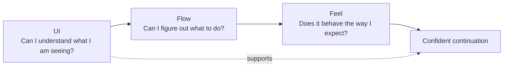
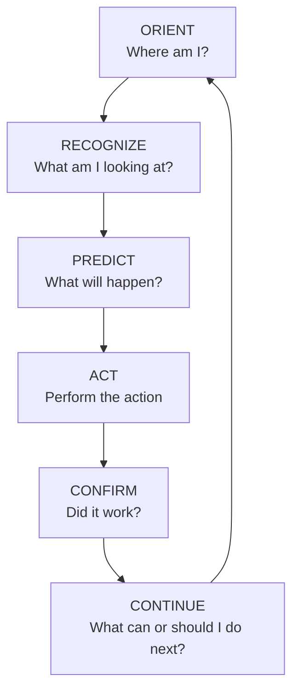
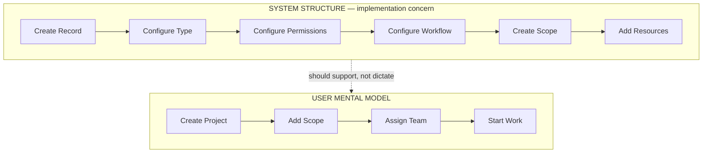
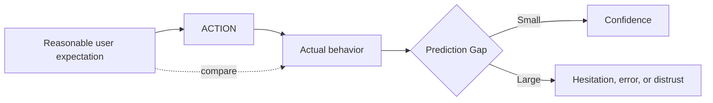
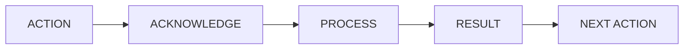
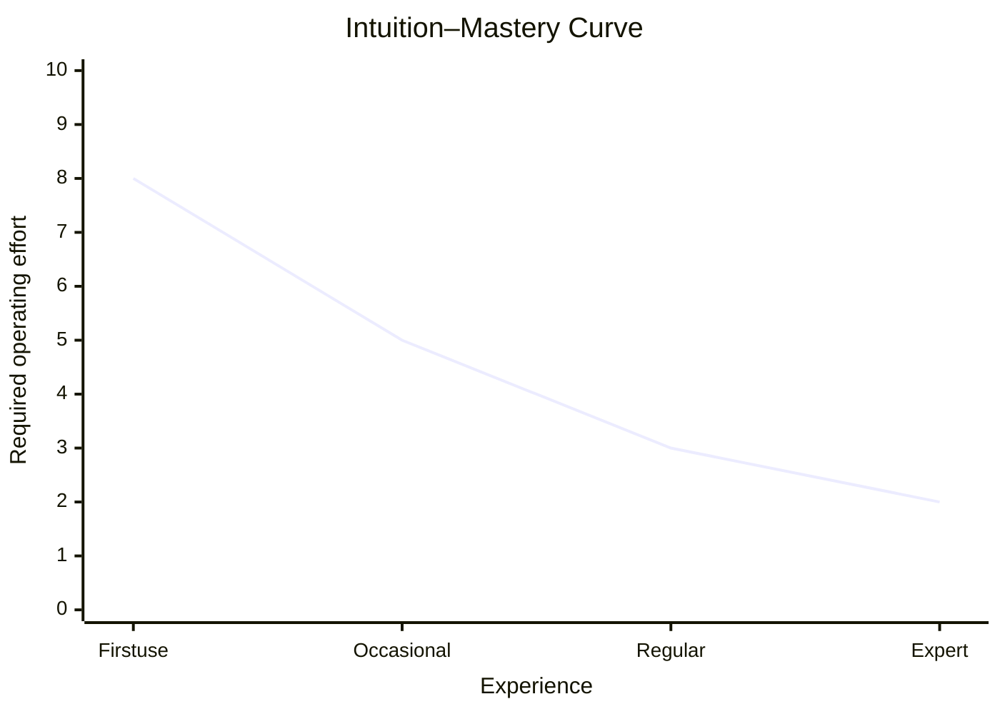

# Intuitive Software Design Standard

Version 1.0 — Normative source

This document is the authoritative standard for the Intuitive Software Design plugin. Companion scorecards, examples, and templates operationalize it; this document controls if wording conflicts.

## Contents

1. [Foundation](#part-i--foundation)
2. [The Intuitive Software Model](#part-ii--the-intuitive-software-model)
3. [Design principles](#part-iii--design-principles)
4. [Friction taxonomy](#part-iv--friction-taxonomy)
5. [Evaluation system](#part-v--evaluation-system)
6. [Application and testing](#part-vi--application-and-testing)
7. [Guardrails](#part-vii--guardrails)

---

# Part I — Foundation

## 1. Definition

> **An interface is intuitive when the intended user can correctly infer what to do next, perform the action with little unnecessary conscious effort, and understand what happened afterward without needing the system explained.**

Intuitive does not mean universally obvious, free of complexity, or requiring zero learning. Intuition is learned prediction: people transfer conventions, domain knowledge, prior experience, and mental models into a new situation.

The standard asks:

> Can the intended user correctly predict how this works based on knowledge and patterns they already understand?

The goal is not to eliminate thinking. The goal is to avoid making people think about how to operate software when they should be thinking about the work they are trying to accomplish.

## 2. Intended user

No intuition judgment is valid without an intended-user frame. Establish:

| Question | Why it matters |
| --- | --- |
| Who performs the task? | Defines relevant knowledge, vocabulary, and conventions. |
| What experience can they reasonably bring? | Separates appropriate expertise from forced discovery. |
| How often do they perform the task? | Changes the balance between initial recognition and repeat efficiency. |
| What is at stake? | Determines needed confirmation, prevention, and recovery. |
| What constraints affect use? | Includes device, environment, time pressure, accessibility, and permissions. |

Infer this frame from reliable context before asking. When user groups differ materially, evaluate them separately. A control may be effortless for a daily estimator, understandable for an occasional project manager, and difficult for a homeowner. That is not a contradiction; it is evidence that intuition is audience-relative.

Do not use “intended user” to excuse avoidable friction. Expertise can justify domain density and terminology; it does not justify hidden state, inconsistent behavior, silent failure, or unnecessary process.

## 3. Intuition, familiarity, and learning

Familiarity is one source of intuition, not the whole definition.

- A familiar pattern can reduce prediction effort.
- A novel pattern can become understandable when its cues, feedback, and consequences are clear.
- A familiar-looking control that behaves unexpectedly creates a severe Prediction Gap.
- Training can teach domain work, but it should not compensate for arbitrary operation.

Evaluate both the first encounter and the mastery curve. Good professional software supports beginner recognition and increasingly efficient expert operation.

## 4. Intuition and simplicity

> **Minimal UI does not automatically mean intuitive UI.**

Distinguish:

| Type | Meaning | Failure example |
| --- | --- | --- |
| Visual simplicity | Few visible elements | Three unlabeled icons look clean but require guessing. |
| Interaction simplicity | Few actions to complete the task | One “Continue” action hides a consequential default. |
| Cognitive simplicity | The intended user can recognize, decide, and predict with little avoidable effort | A dense schedule remains easy for a dispatcher because grouping and state are clear. |

Prioritize cognitive simplicity. Remove elements only when their removal does not transfer work into interpretation, memory, navigation, or recovery.

## 5. Evidence discipline

An evaluation may use source code, screenshots, prototypes, rendered software, specifications, task descriptions, analytics, support evidence, or observed usability sessions. State what was available.

Separate:

- **Observation:** directly visible, executed, documented, or measured.
- **Inference:** a reasoned consequence for the intended user.
- **Unknown:** behavior or state that evidence cannot establish.

Never invent research, behavior, hidden interaction, or user success. Use `NE — Not Evaluated: Insufficient Evidence` instead of a score when the criterion cannot be judged. A screenshot may support hierarchy and label observations but usually cannot prove loading behavior, keyboard operation, recovery, or an end-to-end workflow.

---

# Part II — The Intuitive Software Model

## 6. UI, Flow, and Feel

The model separates three layers so an attractive screen cannot mask an awkward workflow and a sensible workflow cannot mask unpredictable behavior.



### UI — Can I understand what I am seeing?

UI includes orientation, hierarchy, labels, affordances, information clarity, visible actions, current state, and contextual clarity.

Observable questions:

- Can the intended user identify the screen or object in context?
- Can they distinguish primary, secondary, and dangerous actions?
- Do labels and controls communicate purpose without unexplained interpretation?
- Is current state visible without opening another view?
- Is information organized around the task rather than the data model?

### Flow — Can I figure out what to do?

Flow includes entry points, next actions, task sequence, navigation, continuity, decisions, context preservation, backtracking, progress, and completion.

Observable questions:

- Can the user find the correct starting point?
- Does each step match how the user understands the job?
- Are decisions required when they become relevant?
- Does information and state carry forward?
- Can the user tell when the task is complete and what follows?

### Feel — Does the software behave the way I expect?

Feel includes predictability, response, feedback, consistency, state transition, error behavior, recovery, and trust.

Observable questions:

- Does a control produce the result its appearance and label predict?
- Is there an immediate acknowledgment, even when work continues?
- Do similar actions behave similarly?
- Can users distinguish pending, completed, failed, and partially completed states?
- Can mistakes be recovered without hidden loss or arbitrary dead ends?

## 7. Cross-cutting principles

These principles affect more than one layer and should not be forced into a single score:

| Principle | UI | Flow | Feel |
| --- | --- | --- | --- |
| Predictability | Controls signal consequences. | Steps lead where expected. | Results match reasonable expectations. |
| Mental-model alignment | Objects and language match the work. | Sequence follows the job. | State changes preserve domain meaning. |
| Cognitive load | Structure reduces interpretation. | Decisions appear at useful times. | Behavior avoids vigilance and rechecking. |
| Recognition over recall | Relevant state is visible. | Earlier choices carry forward. | The system remembers reliably. |
| Consistency | Similar elements look related. | Similar tasks follow similar paths. | Similar actions behave similarly. |
| Context preservation | Location and object are visible. | Context survives transitions. | State does not appear to reset or drift. |
| Accessibility | Information and controls are perceivable. | Tasks are operable through supported means. | Focus, status, errors, and results are communicated. |
| Feedback | Current state is visible. | Progress and completion are clear. | Actions are acknowledged and resolved. |
| Direct interaction | Actions live near affected objects. | Detours are reduced. | Changes respond at the point of action. |
| Progressive disclosure | Priority is visible without clutter. | Complexity appears when relevant. | Revealed states remain stable and predictable. |
| Error prevention | Risk is distinguishable. | Constraints prevent invalid paths. | Consequences are confirmed where necessary. |
| Error recovery | Error location and cause are clear. | Return paths preserve work. | Recovery is visible and trustworthy. |
| User confidence | State and options are legible. | The next step and completion are clear. | Results and recovery can be trusted. |

## 8. The Intuitive Software Loop



When software feels unintuitive, locate the break:

| Stage | Failure question | Common evidence |
| --- | --- | --- |
| Orient | “Where am I?” | Missing object, account, project, step, or navigation context. |
| Recognize | “What is this?” | Ambiguous labels, unlabeled controls, unclear grouping or state. |
| Predict | “What will happen?” | Vague actions, convention mismatch, hidden consequence. |
| Act | “How do I do it?” | Tiny target, indirect path, inaccessible control, unnecessary steps. |
| Confirm | “Did it work?” | No acknowledgment, unclear pending/success/failure state. |
| Continue | “What now?” | Dead end, missing completion, unclear next action. |

One defect can break multiple stages. Report the earliest decisive break and important downstream effects. For example, an ambiguous “Submit” label breaks Prediction; the absence of a sent state then breaks Confirmation.

## 9. Mental-model alignment

> **Technical Architecture ≠ User Workflow**



The experience should normally follow how the intended user completes the job, not how tables, services, permissions, or backend boundaries happen to be organized. Technical constraints remain real, but expose them only when they change a meaningful user decision, risk, or outcome.

## 10. Prediction Gap

> **Prediction Gap is the distance between what the user reasonably expects an interaction to do and what the software actually does.**



Small gap:

```text
Click project row -> project opens.
```

Large gap:

```text
Click project row -> context menu -> Details -> Manage -> Edit -> project screen.
```

Judge the expectation as reasonable for the intended user and surrounding cues. Novelty alone is not a large gap. A gap becomes important when the control promises one thing and produces another, an expected result requires hidden intermediate work, or the actual consequence cannot be anticipated.

Assess Prediction Gap at high-consequence actions, transitions, defaults, and repeated controls. Record expected behavior, actual behavior, evidence for the expectation, and the effect of the gap.

## 11. Decision Density

> **Decision Density is the number and complexity of meaningful decisions the user must make at a particular point in a workflow.**

Count decisions, then weight their difficulty:

- Does the user understand the options?
- Do they have the information needed now?
- Are choices independent or interdependent?
- What is the consequence of a wrong choice?
- Could the system infer, default, postpone, or remember the choice?

A clean screen with project type, subtype, billing method, workflow, labor model, markup, tax configuration, location profile, and crew type can have high Decision Density despite abundant whitespace. Ask which decisions are required now. Use progressive disclosure, contextual defaults, saved preferences, or a later step only when that reduces work without hiding an important choice.

---

# Part III — Design Principles

Each principle uses the same operating frame: why it matters, how users experience failure, bad and good examples, scoring, testing, common failures, and design considerations.

## 12. Predictability

### Why it matters

Prediction lets a user act with confidence. When consequences are unclear, users pause, experiment, avoid actions, or recheck completed work.

### How users experience the problem

“Will this save, send, open, delete, or take me somewhere else?” The cost grows with consequence and frequency.

### Bad example

`Done` closes a proposal editor but does not say whether the draft was saved or sent.

### Good example

`Save draft` stores without sending. `Send proposal` opens a clear final confirmation when recipients or terms matter.

### How to score it

Observe whether the intended user can state the likely consequence before acting and whether actual behavior matches. A correct guess after trial and error is not intuitive prediction.

### How to test it

Pause before activation and ask, “What do you expect to happen?” Compare the answer with the result and note consequence, confidence, and correction.

### Common failure patterns

- vague verbs such as Done, Go, Process, or Continue at consequential points;
- familiar-looking controls with nonstandard behavior;
- row, card, and icon hit areas that trigger different destinations without cues;
- hidden defaults that materially change the result.

### Design considerations

Use specific verbs, visible consequences, stable patterns, and confirmations proportionate to risk. Do not add confirmation to safe, reversible, frequent actions merely to appear cautious.

## 13. Mental-model alignment

### Why it matters

Users organize work around domain objects and outcomes. Translating system structure into user steps consumes attention and causes sequencing errors.

### How users experience the problem

“Why do I configure a workflow record before I can create the job I came here to create?”

### Bad example

Create Record -> choose schema type -> configure permissions -> add resource -> rename it “Project.”

### Good example

Create Project -> add scope -> assign team. The system creates supporting records behind the interaction.

### How to score it

Compare nouns, sequence, and decisions with how the intended user describes the task. Domain expertise is evidence, not a reason to replace domain language with generic UI terms.

### How to test it

Ask the user to describe the job before showing the flow. Compare the natural sequence with the product sequence and note translation steps.

### Common failure patterns

- database entities exposed as primary tasks;
- permissions architecture presented before a meaningful object exists;
- organizational boundaries forcing repeated handoffs or re-entry;
- internal status codes used instead of job-relevant state.

### Design considerations

Keep technical controls accessible when advanced users genuinely need them. Place them where their domain consequence becomes relevant.

## 14. Recognition over recall

### Why it matters

Human working memory should not be used as temporary application storage. Visible context supports accurate decisions and reduces rechecking.

### How users experience the problem

“What customer, project type, or amount did I choose on the previous screen?”

### Bad example

A scope screen omits the customer and estimate selected one step earlier, so the estimator navigates back to verify them.

### Good example

The project, customer, selected type, totals, and current step remain visible or available in context.

### How to score it

Identify information needed for the current decision and whether the system presents or carries it forward.

### How to test it

List facts a user must remember between steps; observe backtracking, repeated lookup, copying, notes, or help use.

### Common failure patterns

- cleared fields after validation errors;
- filters, selections, or sort state lost on return;
- codes copied from one screen to another;
- instructions visible only before they are needed.

### Design considerations

Show the smallest sufficient context. Persistent context can be compact or expandable; it should not overwhelm the task.

## 15. Context and orientation

### Why it matters

At meaningful points, users must answer: Where am I? What am I looking at? What can I do? What happened? What is next?

### How users experience the problem

“Am I editing the project, the estimate template, or the customer default?”

### Bad example

The page title says `Settings` while the selected customer, project, and configuration scope are absent.

### Good example

`Acme Hospital / Estimate 1042 / Pricing settings`, with the relevant navigation state and unsaved-change status.

### How to score it

Judge whether location, object, scope, and current state can be identified from the working view without reconstructing the path.

### How to test it

Open a deep link or resume after interruption and ask the user to name location, object, state, and next viable action.

### Common failure patterns

- generic titles;
- missing selected tab or navigation state;
- modals without object context;
- breadcrumbs added mechanically but not clarifying scope;
- progress indicators that show position without meaningful step names.

### Design considerations

Use titles, selected navigation, breadcrumbs, object identity, progress, or persistent context only where each clarifies the task. Extra chrome is not the goal.

## 16. Direct interaction

### Why it matters

Actions near the affected object reduce navigation and strengthen the connection between action and result.

### How users experience the problem

“Why do I leave the team list, open Manage, choose Personnel, find the same employee, and then change the role?”

### Bad example

Employee -> overflow menu -> Manage -> Edit -> Role.

### Good example

`John Smith   Foreman ▼`, with permission checks and confirmation if the change carries risk.

### How to score it

Count detours and evaluate whether the relationship between object, action, and changed state is visible.

### How to test it

Ask users where they would act on a visible object. Record whether the action is found near the object and whether the result appears there.

### Common failure patterns

- global settings for local changes;
- hidden overflow menus for frequent actions;
- drag-only interaction without keyboard or menu alternative;
- inline editing used for risky changes without confirmation or recovery.

### Design considerations

Directness is not absolute. High-risk changes, complex dependencies, permissions, or multi-object edits can justify a focused management flow.

## 17. Feedback and state visibility

### Why it matters

There should rarely be an unexplained gap between action and visible response.



### How users experience the problem

“Did Send work, should I click again, or is it still processing?”

### Bad example

`Send proposal` remains unchanged for eight seconds, then the screen silently returns to the list.

### Good example

`Send proposal` -> `Sending…` -> `Proposal sent` with recipient, time, and `View proposal`; failure stays visible with retry and preserved work.

### How to score it

Evaluate acknowledgment latency, pending state, result clarity, failure visibility, partial completion, and continuation.

### How to test it

Exercise success, slow, failure, retry, background, and partial-completion states. Check visual, semantic, and assistive-technology announcements.

### Common failure patterns

- enabled controls that accept duplicate activation while pending;
- optimistic success with no later failure exposure;
- autosave without saved/failed state;
- background work that disappears from view;
- status shown by color alone.

### Design considerations

Acknowledgment should be immediate; completion should be honest. Preserve the user's work and expose what can be done next.

## 18. Progressive disclosure

### Why it matters

Show what the user needs now and reveal additional complexity when it becomes relevant. The aim is lower Decision Density, not hidden capability.

### How users experience the problem

Either “Why must I decide all of this before starting?” or “Where did the option I need go?”

### Bad example

A new-project form requires tax profile, labor model, crew type, markup, permissions, and notifications before the name and customer can be saved.

### Good example

Name, customer, and type are visible; relevant advanced settings are summarized and discoverable. Required consequential choices appear before they affect work.

### How to score it

Judge whether decisions appear with the information and timing needed, whether defaults are safe, and whether hidden options remain discoverable.

### How to test it

Identify each decision, when it becomes necessary, its consequence, and whether users can find deferred options without help.

### Common failure patterns

- “Advanced” as a dumping ground;
- required choices revealed after work depends on them;
- destructive or billing consequences hidden behind defaults;
- staged forms that create more navigation than cognitive relief.

### Design considerations

Do not hide frequent or high-consequence controls. Summarize deferred configuration and let users inspect or change it at the right point.

## 19. Consistency

### Why it matters

Consistency lets knowledge transfer. Inconsistency forces users to inspect and relearn each instance.

### How users experience the problem

“Why does this row open details here but select the row somewhere else?”

### Bad example

The same trash icon archives on one screen and permanently deletes on another.

### Good example

Archive and Delete are distinct, labeled, and behave consistently; deviations are visible and justified by context.

### How to score it

Compare appearance, wording, placement, keyboard behavior, state transitions, and consequence across similar tasks.

### How to test it

Sample repeated patterns and ask users to predict behavior from earlier encounters.

### Common failure patterns

- synonymous labels for the same action;
- identical labels with different consequences;
- component variants that lose important states;
- copied patterns used where domain consequences differ.

### Design considerations

Consistency is not sameness. Preserve a shared rule, and make meaningful differences visible.

## 20. Error prevention and recovery

### Why it matters

Intuitive software helps users avoid predictable mistakes and recover without losing work, context, or trust.

### How users experience the problem

“What went wrong, what was affected, and how do I continue?”

### Bad example

After a validation error, the form clears and shows `Invalid input` at the top.

### Good example

Valid work remains. The affected field is identified with a specific fix. Focus moves appropriately, a summary links to the error, and retry is clear.

### How to score it

Evaluate constraint visibility, dangerous-action distinction, error specificity, work preservation, recovery path, and confirmation of restored state.

### How to test it

Trigger realistic validation, permission, network, conflict, timeout, and destructive-action cases. Observe whether users can diagnose and recover unaided.

### Common failure patterns

- errors detached from causes;
- retry that repeats a harmful or duplicate action;
- unrecoverable destructive actions without proportionate warning;
- cancellation that silently discards work;
- dead ends after access or system errors.

### Design considerations

Use prevention where constraints are known, undo for safe reversible actions, and confirmation for high-consequence actions. Avoid confirmation fatigue.

## 21. Accessibility as intuitive operation

### Why it matters

An interface cannot be fully intuitive for its intended audience if people cannot perceive state, reach controls, understand labels, or operate and recover through supported input and assistive technology.

### How users experience the problem

“The control is visible but unreachable by keyboard,” or “the screen reader announces success as unlabeled text after focus has moved elsewhere.”

### Bad example

Status is conveyed only by red/green color, a role can be changed only by drag, and errors do not receive focus or announcement.

### Good example

Controls have meaningful names and semantics, focus is visible and logical, status uses text and semantic announcements, targets are operable, and drag has an accessible alternative.

### How to score it

Accessibility evidence affects the relevant UI, Flow, and Feel criteria. Do not fabricate a separate accessibility score or claim full intuition when confirmed barriers block intended users.

### How to test it

Use keyboard-only operation, focus inspection, semantic inspection, zoom/reflow, contrast checks, screen-reader paths, non-color state review, and alternatives to pointer gestures as applicable.

### Common failure patterns

- unlabeled icons;
- invisible or illogical focus;
- nonsemantic custom controls;
- status not announced;
- drag-only or hover-only actions;
- inaccessible error and recovery paths.

### Design considerations

Record what was actually tested. A screenshot alone cannot establish keyboard or screen-reader behavior.

## 22. Intuition–Mastery Curve

Professional software must support beginner recognition and expert efficiency.



Fallback interpretation:

```text
Required operating effort
  |\
  | \
  |  \
  |   \________
  +---------------- Experience
```

### Why it matters

Visible labels, examples, and safe defaults support early use. Keyboard shortcuts, bulk actions, saved views, command palettes, and automation support mastery.

### How users experience the problem

Beginners ask “Where do I start?” Experts ask “Why must I repeat this?”

### Bad example

An expert shortcut is the only path and has no visible discovery, or a repetitive wizard remains mandatory for a daily expert.

### Good example

A labeled Save action remains available while `Ctrl/Cmd+S` is discoverable; frequent users can reuse settings or perform safe bulk actions.

### How to score it

Evaluate relevant user groups separately. Do not average beginner and expert experiences into a vague middle.

### How to test it

Measure first-action recognition for new users and repeated-step cost for experienced users. Look for learning transfer and increasing efficiency.

### Common failure patterns

- shortcuts without discovery or alternatives;
- beginner scaffolding that cannot be bypassed after mastery;
- advanced density without hierarchy;
- oversimplification that removes expert context or control.

### Design considerations

Do not sacrifice discoverability for expert speed or professional capability for visual simplicity.

---

# Part IV — Friction Taxonomy

Use the taxonomy to replace “clunky” with a cause that can be tested and corrected. A finding may contain multiple friction types; name the primary source and important secondary effects.

## 23. Navigation Friction — Where do I go?

- **Definition:** effort spent locating the correct destination or returning to context.
- **Symptoms:** wrong destinations, menu scanning, repeated backtracking, deep detours, dead ends.
- **Example:** assigning a worker requires leaving the project for global administration.
- **Likely causes:** task-based actions organized by system modules; hidden or inconsistent entry points; context-free navigation.
- **Identify:** trace the intended path and record wrong-path selections, destination uncertainty, and transitions unrelated to the job.
- **Typical responses:** expose a clear entry point near the task, keep contextual actions with objects, preserve return location, simplify only the unnecessary path.

## 24. Interpretation Friction — What does this mean?

- **Definition:** effort spent translating labels, controls, status, structure, or terminology.
- **Symptoms:** hesitation, tooltips required for basic actions, repeated explanation, misread state.
- **Example:** a button labeled `Process` could save, calculate, submit, or send.
- **Likely causes:** vague language; icon-only controls; internal terminology; weak hierarchy; state conveyed indirectly.
- **Identify:** ask intended users to explain visible controls and state before acting.
- **Typical responses:** specific domain language, labels, clearer grouping, visible state, examples only when unfamiliar domain concepts require them.

## 25. Decision Friction — Which option should I choose?

- **Definition:** avoidable effort caused by too many, too complex, poorly timed, or insufficiently informed decisions.
- **Symptoms:** option comparison loops, arbitrary defaults, abandonment, frequent wrong selections.
- **Example:** nine interdependent configuration choices appear before a project can be named.
- **Likely causes:** high Decision Density; missing defaults or recommendations; choices required before information exists; distinctions users do not value.
- **Identify:** inventory decisions, timing, required knowledge, consequence, and whether the system can safely infer or defer each one.
- **Typical responses:** stage decisions by relevance, explain consequential tradeoffs, use safe contextual defaults, remember repeat choices, remove meaningless distinctions.

## 26. Interaction Friction — How do I do this?

- **Definition:** effort spent discovering or physically performing an action.
- **Symptoms:** missed targets, hover hunting, repeated clicks, indirect editing, inaccessible gestures.
- **Example:** changing a visible role requires an unrelated overflow-menu chain.
- **Likely causes:** weak affordance; small or hidden targets; action separated from object; modality mismatch; inaccessible control.
- **Identify:** observe first attempts, click/keyboard paths, errors, and target discovery.
- **Typical responses:** recognizable controls, direct contextual actions, usable targets, visible focus, accessible alternatives, reduced mechanical steps.

## 27. Memory Friction — What did I select or learn earlier?

- **Definition:** avoidable recall of information the system already has or could present.
- **Symptoms:** backtracking, copying values, external notes, repeated lookup, re-entry.
- **Example:** the user must remember the selected customer while configuring scope on another screen.
- **Likely causes:** lost state; missing summaries; disconnected steps; cleared inputs; context hidden at decision time.
- **Identify:** list facts required across steps and observe how users retrieve them.
- **Typical responses:** carry state forward, show compact context, retain valid input, contextualize options, restore filters and position.

## 28. Feedback Friction — Did that work?

- **Definition:** uncertainty between action, processing, result, and next step.
- **Symptoms:** duplicate activation, repeated refresh, support questions, distrust, abandoned pending work.
- **Example:** Send produces no visible change.
- **Likely causes:** missing acknowledgment; ambiguous pending/success/failure; background work without status; stale state.
- **Identify:** exercise slow and failure states and ask the user what the system is doing now.
- **Typical responses:** immediate acknowledgment, honest progress, explicit result, failure and retry, visible affected state, clear continuation.

## 29. Recovery Friction — How do I fix what happened?

- **Definition:** effort or inability to diagnose, reverse, correct, or resume after an error or unwanted result.
- **Symptoms:** dead ends, lost work, repeated failed retries, fear of experimentation, support dependence.
- **Example:** a validation failure clears the form and supplies no field-specific cause.
- **Likely causes:** vague errors; destructive irreversibility; missing undo/retry; context loss; partial completion hidden.
- **Identify:** trigger realistic failures and assess diagnosis, preservation, correction, and confirmation.
- **Typical responses:** specific cause and location, preserved work, safe retry, undo or proportionate confirmation, explicit partial outcome and recovery path.

## 30. Process Friction — Why must I do all these steps?

- **Definition:** work imposed by the software that does not meaningfully advance the user's task, safety, or required control.
- **Symptoms:** duplicate entry, administrative detours, unnecessary approvals, repeated confirmations, serial steps that could be combined.
- **Example:** creating a project requires separately creating and linking records that the system could create from one task action.
- **Likely causes:** technical architecture exposed as workflow; organizational boundaries; legacy policy; automation gaps; speculative setup.
- **Identify:** mark every step by user value, necessary risk control, or implementation leakage.
- **Typical responses:** automate or combine redundant work, reuse known information, align sequence to the job, preserve required oversight without repeated operation.

---

# Part V — Evaluation System

## 31. Behavioral 0–4 scale

Use only this scale. Scores describe supported user behavior, not visual taste.

| Score | Label | Behavioral meaning |
| ---: | --- | --- |
| 0 | Broken | The intended user cannot reasonably infer what to do or what will happen; intervention is required or completion is prevented. |
| 1 | Difficult | Explanation, experimentation, repeated correction, or substantial avoidable conscious effort is required. |
| 2 | Understandable | The interaction can be figured out, but noticeable thought, interpretation, or rechecking is required. |
| 3 | Intuitive | Most intended users should correctly understand and predict the interaction without assistance. |
| 4 | Effortless | The interaction closely matches established mental models and needs minimal operating attention, including clear result and continuation. |
| NE | Not Evaluated | Available evidence cannot support a score. Exclude from calculations and state what evidence is missing. |

Score the criterion, not the evaluator's overall impression. A score requires evidence and a short rationale. Use the detailed behavioral anchors in [scoring-reference.md](scoring-reference.md).

## 32. Screen-level scorecard

Evaluate an individual screen with:

| Criterion | Core question |
| --- | --- |
| Orientation | Can the intended user identify location, object, scope, and state? |
| Visual hierarchy | Can they distinguish purpose, primary information, and priority? |
| Action clarity | Can they identify available actions and the primary action? |
| Control recognition | Can they recognize how controls operate and what they affect? |
| Information clarity | Can they interpret the information needed for the task? |
| Feedback/state visibility | Can they see current, pending, success, failure, and changed state where relevant? |
| Cognitive load | Is avoidable interpretation, recall, or decision effort controlled? |
| Consistency | Do patterns transfer from comparable parts of the product and relevant conventions? |

Do not infer workflow quality from a screen average. Screenshots rarely support full Feel evaluation.

## 33. Workflow-level scorecard

Evaluate a complete task with:

| Criterion | Core question |
| --- | --- |
| Entry-point clarity | Can the user find the correct starting point? |
| Next-action clarity | Is the next useful action apparent at each step? |
| Sequence matches user task | Does the order follow the user's job and dependencies? |
| Context preservation | Does identity, state, and relevant information carry through? |
| Decision load | Are necessary decisions understandable and timed appropriately? |
| Backtracking required | Can completion occur without avoidable reversals or detours? |
| Progress visibility | Can the user see current position and unresolved work? |
| Completion confidence | Can the user tell the task succeeded and what is now true? |
| Error recovery | Can realistic mistakes and failures be diagnosed and corrected without avoidable loss? |
| Prediction consistency | Do actions and transitions repeatedly match reasonable expectations? |

A product can contain visually excellent screens and still have an unintuitive workflow.

## 34. Product-level assessment

Summarize three dimensions on a 0–100 scale only when evidence is broad enough:

- **UI Clarity:** mean of evaluated screen-criterion scores across a representative screen set, normalized by `score / 4 × 100`.
- **Flow Intuition:** mean of evaluated workflow-criterion scores across representative priority workflows, normalized the same way.
- **Behavior Confidence:** mean of evaluated predictability, feedback/state, consistency, and recovery evidence across representative interactions, normalized the same way.

The default overall score is the unweighted mean of the three dimensions only when all three are evaluated. If product risk justifies weights, define them before scoring and explain them. Do not manufacture missing dimensions or silently treat `NE` as zero.

The number is secondary. Lead with:

```text
Primary Weakness: Workflow continuity
Major Friction: Users lose project context between Estimate Setup and Scope Configuration.
Critical Failures: 1 — successful proposal sending has no visible confirmation.
```

Report coverage: screens, workflows, roles, states, devices, accessibility methods, and important exclusions. Product scores without coverage are misleading.

## 35. Severity model

Severity measures consequence and recurrence, not the same thing as intuition score.

| Severity | Meaning |
| --- | --- |
| Critical | Prevents a critical task, creates dangerous misunderstanding, risks unrecoverable consequences, or fundamentally contradicts a high-consequence expectation. |
| High | Causes repeated errors, substantial workflow friction, significant confusion, loss of confidence, or major unnecessary effort. |
| Medium | Causes noticeable hesitation, extra navigation, avoidable decisions, rechecking, or recurring minor mistakes. |
| Low | Creates small but real friction without materially threatening completion. |

Consider task importance, affected users, frequency, consequence, detectability, and recoverability. Do not label every score of 0 Critical or every score of 3 Low.

## 36. Intuition Critical Failures

A Critical Failure is a class of intuition failure that must be reported separately from scores. Confirm it with evidence and state affected users/tasks, consequence, severity, and recovery.

Critical Failure candidates include:

- primary action is ambiguous at a consequential point;
- an important action provides no visible confirmation;
- navigation produces an unexpected consequential destination;
- destructive actions are insufficiently distinguishable;
- a destructive action cannot reasonably be recovered;
- the user reaches a dead end in a required task;
- software silently changes important user data;
- critical state is hidden;
- identical controls behave differently in ways that can cause harm or material error;
- the user must remember critical information the system already possesses;
- an important error cannot reasonably be recovered;
- successful completion is unclear for a critical task;
- an interaction strongly contradicts established expectations with serious consequence;
- an accessibility barrier prevents an intended user from completing a critical task.

Critical-failure procedure:

1. Record the exact observable evidence.
2. Identify intended user, task, and affected state.
3. Explain consequence and current recovery.
4. Assign severity independently.
5. Keep it outside aggregates and headline it in the report.
6. Recommend the smallest complete containment and correction.

The list identifies candidates, not automatic labels. Missing confirmation on a low-consequence preference may be Medium feedback friction; missing confirmation after sending a binding proposal may be Critical.

## 37. Finding format

```text
Finding: [specific problem]
Area: UI | Flow | Feel | Cross-Cutting
Principle: [standard principle]
Friction Type: [taxonomy term]
Loop Break: Orient | Recognize | Predict | Act | Confirm | Continue
Evidence: [observable evidence]
User Impact: [effect on intended user and task]
Severity: Critical | High | Medium | Low
Score: [criterion and 0-4, or NE]
Recommendation: [smallest complete corrective change]
Expected Outcome: [observable improvement]
```

Use the full shape for formal reviews and audits. Quick advice can be shorter, but it must remain specific.

---

# Part VI — Application and Testing

## 38. Audit process

Begin every audit with:

```text
TASK: Create a new project
INTENDED USER: Project Manager
STARTING POINT: Projects Dashboard
SUCCESS CONDITION: Project created and ready for scheduling
EVIDENCE: [screens, source, runtime, spec, observation]
EXCLUSIONS: [states or methods not evaluated]
```

Then:

1. Walk the Intuitive Software Loop at every meaningful transition.
2. Evaluate available UI, Flow, and Feel evidence separately.
3. Record Prediction Gaps and their consequence.
4. Inventory decisions and identify high Decision Density.
5. Tag friction types and identify the underlying source.
6. Score supported screen or workflow criteria with evidence.
7. Check Critical Failures independently.
8. Prioritize by severity, task importance, frequency, and dependency.
9. Recommend smallest complete changes, including pending, success, failure, and recovery states where relevant.
10. Define observable validation for each important recommendation.

Audit questions:

1. Can the user find where to begin?
2. Can the user understand what they are seeing?
3. Is the next action apparent?
4. Does each action produce the expected result?
5. Is context preserved?
6. Must the user remember information the system has?
7. Is current state visible?
8. Can mistakes be recovered?
9. Is progress understandable?
10. Is completion unambiguous?
11. Can major controls be predicted before activation?
12. Are unnecessary decisions or steps present?

## 39. Design process

For a new design:

1. Define user, job, starting point, success state, risks, and frequency.
2. Sketch the user's mental-model sequence before screens or components.
3. Walk Orient -> Recognize -> Predict -> Act -> Confirm -> Continue.
4. Inventory required information and decisions; defer only what can safely wait.
5. Define default, empty, loading, pending, success, failure, partial, permission, offline, and recovery states that actually apply.
6. Check accessibility and alternate input at the interaction-contract level.
7. Define measurable requirements.
8. Propose structure and controls only after the behavior is coherent.

Do not pretend a proposed design has observed usability evidence. Label predictions and validation needs honestly.

## 40. Review process

For an existing design or implementation:

- lead with the most consequential observable problem;
- cover UI, Flow, and Feel only where evidence supports them;
- treat static visual restraint or attractiveness as UI evidence, not proof of behavior confidence or Feel;
- avoid numeric scoring in an ordinary review unless the user requests it or the review is explicitly formal;
- distinguish a code-path concern from runtime proof;
- cite the exact control, transition, state, or missing state;
- state the intended-user consequence as an inference when it was not directly observed;
- avoid generic advice such as “improve feedback” or “simplify the screen.”

Preferred diagnosis:

> Users cannot tell whether the proposal was sent because Send has no visible pending or completed state.

Preferred recommendation:

> Keep the existing action. Change it to Sending… immediately, disable duplicate activation while pending, then show Sent with recipient and time; preserve the draft and expose retry on failure.

## 41. Improve process

Improvement is diagnosis-driven:

```text
Evidence -> Loop break -> Friction source -> Smallest complete change -> Observable outcome
```

Rank changes by critical failures, high-severity task barriers, repeated friction, and foundational fixes that resolve multiple findings. Preserve effective conventions, domain density, workflows, and components. Do not modernize, flatten, rename, hide, or add navigation without a demonstrated benefit.

A complete change handles the relevant interaction contract. A new success label without pending and failure behavior may be smaller, but it is incomplete when network work can fail.

## 42. Measurable usability requirements

Convert vague intent into observable behavior:

| Measure | Indicates |
| --- | --- |
| First-action success | Whether users recognize the correct entry point. |
| Task completion rate | Whether the full workflow can succeed. |
| Wrong-path selections | Navigation, interpretation, or prediction problems. |
| Backtracking | Context, sequence, memory, or confidence problems. |
| Error rate | Control, decision, constraint, or expectation mismatch. |
| Help usage | Where the interface does not carry necessary explanation. |
| Time to first meaningful action | Orientation and recognition cost. |
| Abandoned actions | Confidence, consequence, process, or recovery barriers. |
| Completion confidence | Whether users understand the result and current state. |
| Perceived effort | Operating effort not fully visible in task time. |

Example requirement:

> A first-time intended user can identify the correct project-creation action without assistance and can state what will happen before activating it.

Do not impose one universal threshold. Establish baselines and targets appropriate to task frequency, consequence, audience, and product maturity.

## 43. AI-agent evaluation rules

An AI reviewer must:

- declare intended user, task, success condition, evidence, and exclusions;
- analyze UI, Flow, Feel, cross-cutting principles, Loop break, friction, Prediction Gap, Decision Density, and Critical Failures as applicable;
- use `NE` rather than confident scoring from insufficient evidence;
- distinguish observation, inference, and recommendation;
- avoid aesthetic taste and generic modernization;
- produce evidence-linked smallest-complete-change recommendations;
- state validation that would prove improvement.

Use [ai-review-template.md](ai-review-template.md) for the complete output shape.

---

# Part VII — Guardrails

## 44. Required guardrails

The standard must not be used to:

- confuse aesthetic preference with intuitiveness;
- assume minimal interfaces are inherently better;
- automatically recommend a redesign;
- favor novelty over familiar, effective patterns;
- penalize appropriate professional complexity or domain terminology;
- invent usability evidence or user behavior;
- assign confident scores without sufficient evidence;
- hide Critical Failures inside aggregate scores;
- recommend additional components, abstractions, steps, or navigation without clear benefit;
- treat technical architecture as the default user workflow;
- claim an inaccessible experience is fully intuitive;
- remove necessary risk controls in the name of fewer steps.

## 45. Quality-control checklist

Before accepting a design, review, audit, or improvement:

- Is intuitive defined relative to the intended user?
- Are UI, Flow, and Feel distinct?
- Is the broken Loop stage identified where evidence permits?
- Are Prediction Gap and Decision Density used diagnostically, not decoratively?
- Are friction types precise and understandable?
- Do scores have behavioral evidence and `NE` coverage?
- Are screens and workflows evaluated separately?
- Are Critical Failures outside aggregates?
- Are examples and recommendations concrete?
- Are accessibility and recovery part of the interaction contract?
- Are beginner recognition and expert efficiency both considered when relevant?
- Does each recommendation solve the underlying problem with the smallest complete change?
- Does the result help the user think about their work instead of the software?

If any material answer is no, the evaluation or design is incomplete.
